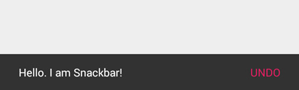

# Material Design
材料设计分享，学习

[TOC]

## 说明
该项目用于材料设计学习，分享

## 主题

### 兼容
- 兼容低版本继承V7中的Theme.AppCompat
- API 21 以上继承系统自带的android:Theme.Material

### 样式配置
- 如图


```xml

<!-- 默认标题的颜色-->
        <item name="android:textColorPrimary">@color/CommonText</item>

        <!--默认字体颜色-->
        <item name="android:textColor">@color/Black</item>

        <!--  colorControlNormal则是应用在图标上-->
        <item name="colorControlNormal">@color/CommonText</item>
        <!-- 还可以设置 colorControlNormal, colorControlActivated colorControlHighlight, 和 colorSwitchThumbNormal 的值来控制控件的颜色. -->
        <item name="colorControlHighlight">@color/LightSalmon</item>

        <!--<item name="android:colorControlActivated">@color/PeachPuff</item>-->


        <item name="android:textColorSecondary">@color/CommonText</item>
        <!--actionbar颜色-->
        <!--colorPrimary（原色）：它作为应用的主要色调，一般是操作栏和最近任务的背景色。-->
        <item name="colorPrimary">@color/CommonTitle</item>
        <!--状态栏颜色,仅在Lollipop以上机器生效-->
        <!--color Primary Dark（色原变暗）：原色的变暗色调，应用在状态栏上。-->
        <item name="colorPrimaryDark">@color/CommonTitle</item>
        <!--按钮下划线颜色-->
        <!--colorAccent（色彩突显）：它是原色的强调色彩，应用在框架控制上,CheckBox 选中等。-->
        <item name="colorAccent">@color/CommonButton</item>
        <!--屏幕背景色-->
        <item name="android:windowBackground">@color/White</item>
        <item name="actionBarStyle">@style/ActionBar</item>

        <!--这里是定义系统默认actionbar的地方,自己写的需要在actionbar中自己声明,还有PopMenu-->
        <!--<item name="android:actionBarStyle">@style/ActionBar</item>-->

        <!--取除左上角背景 Home区域-->
        <item name="selectableItemBackground">@null</item>


        <!--底部3个按键栏的颜色,5.1以上可用-->
        <!--<item name="android:navigationBarColor">@color/Violet</item>-->
        <!-- translucent system bars -->

```

## 库介绍

### support design (方法数 2126)

位置 : ~/android-sdk-linux/extras/android/support/design

+ EditText
+ Spinner
+ CheckBox
+ RadioButton
+ Switch（使用supportV7中的SwitchCompat，https://developer.android.com/reference/android/support/v7/widget/SwitchCompat.html）
+ CheckedTextView

你不需要做任何特殊的工作，只需像以前一样在你的布局中使用这些控制并且AppCompat会为你做剩下的工作（请看FAQ）。


#### TabLayout

- 背景色会自动设置成 primary color(主题色)
- app:tabMode
	* fixed
	* scrollable

- app:tabGravity
	* fill
	* center

#### FloatingActionButton

- app:fabSize="normal"是用来定义 FAB 的大小的（推荐 40dp 的清晰的 png 文件）
    * normal的意思是在大多数情况下标准尺寸为 56dp 的按钮
    * mini是另一个选择，它的大小将变成 40dp

- 按钮的颜色，FAB 基本上使用强调色，重写app:backgroundTint属性来修改
- app:elevation 为空闲状态下的阴影深度(6dp 在空闲状态)
- app:pressedTranslationZ为按下状态的(12dp 是按下状态)
- app:backgroundTint - 设置FAB的背景颜色。
- app:rippleColor - 设置FAB点击时的背景颜色。
- app:borderWidth - 该属性尤为重要，如果不设置0dp，那么在4.1的sdk上FAB会显示为正方形，而且在5.0以后的sdk没有阴影效果。所以设置为borderWidth="0dp"。
- src - 设置FAB的图标，Google建议符合Design设计的该图标大小为24dp。

- app:layout_anchor - 设置FAB的锚点，即以哪个控件为参照点设置位置。(*可以指定不在同一个父类的view*)
- app:layout_anchorGravity - 设置FAB相对锚点的位置，值有 bottom、center、right、left、top等。

	[Floating Action Buttons的动态处理](https://guides.codepath.com/android/Floating-Action-Buttons)

#### NavigationView
- Google 提供简单的侧滑样式
	
- 代码也很简单
```xml
<android.support.v4.widget.DrawerLayout
  xmlns:android="http://schemas.android.com/apk/res/android"
  xmlns:app="http://schemas.android.com/apk/res-auto"
  android:layout_width="match_parent"
  android:layout_height="match_parent">
    <!-- 需要呈现的内容 -->
    <android.support.design.widget.NavigationView
      android:layout_width="wrap_content"
      android:layout_height="match_parent"
      android:layout_gravity="start"
      app:headerLayout="@layout/drawer_header"
      app:menu="@menu/drawer"/>
</android.support.v4.widget.DrawerLayout>
```
其中 app:headerLayout 用于指定一个任意的布局，作为导航抽屉的顶部，如效果图中的紫色带 Username 字样部分。

- app:menu 用于指定导航抽屉的菜单项，具体代码如下

    ```xml
    <menu xmlns:android="http://schemas.android.com/apk/res/android">
      <group android:checkableBehavior="single">
        <item
          android:id="@+id/nav_home"
          android:icon="@drawable/ic_dashboard"
          android:title="Home" />
        <item
          android:id="@+id/nav_messages"
          android:icon="@drawable/ic_event"
          android:title="Messages" />
        <item
          android:id="@+id/nav_friends"
          android:icon="@drawable/ic_headset"
          android:title="Friends" />
        <item
          android:id="@+id/nav_discussion"
          android:icon="@drawable/ic_forum"
          android:title="Discussion" />
      </group>
      <item android:title="Sub items">
        <menu>
          <item
            android:icon="@drawable/ic_dashboard"
            android:title="Sub item 1" />
          <item
            android:icon="@drawable/ic_forum"
            android:title="Sub item 2" />
        </menu>
      </item>
    </menu>
    ```

#### Snackbar(Toast 增强型)

- Snackbar 和 Toast 有着相同的概念，但是不同于 Toast，它的表现是作为 UI 的一部分而不是覆盖在屏幕上。

	

    ```java
    Snackbar.make(someView, "Hello. I am Snackbar!", Snackbar.LENGTH_SHORT)
    .setAction("Undo", new View.OnClickListener() {
          @Override
          public void onClick(View v) {
           }
         }).show();

    ```
这里的view可以时任意的view,它会根据view去遍历查找根view(Snackbar源代码 Handler写的很奇怪)

- 低于 Android L 的系统上，当 Snackbar 滑动消失的时候，FAB 忘记了移动下来。只需要为低于 Android L 的系统改变 margin 的值为 0.1dp(不好用)

#### SwipeRefreshLayout
- 下拉圈圈的颜色设置

    ```java
    srlRefresh.setOnRefreshListener(this);
    srlRefresh.setColorSchemeResources(
            R.color.Tomato,
            R.color.Yellow,
            R.color.Turquoise,
            R.color.Teal);
    @Override
    public void onRefresh() {
		// 隐藏
       srlRefresh.setRefreshing(false);

    }

    ```

- 布局

    ```xml
    <?xml version="1.0" encoding="utf-8"?>
    <android.support.v4.widget.SwipeRefreshLayout
        android:id="@+id/srl_refresh"
        xmlns:android="http://schemas.android.com/apk/res/android"
        android:layout_width="match_parent"
        android:layout_height="match_parent"
        >

        <android.support.v7.widget.RecyclerView
            android:id="@+id/rv_list"
            android:layout_width="match_parent"
            android:layout_height="match_parent"
            android:clipToPadding="false"
            />
    </android.support.v4.widget.SwipeRefreshLayout>
    ```

#### TextInputLayout

- code

    ```xml
        <android.support.design.widget.TextInputLayout
            android:id="@+id/til_name"
            android:layout_width="match_parent"
            android:layout_height="wrap_content">

            <EditText
                android:layout_width="match_parent"
                android:layout_height="wrap_content"
                android:hint="用户名"/>
        </android.support.design.widget.TextInputLayout>
    ```

- 设置错误信息

    ```java
       	EditText et_content = tilName.getEditText();
            tilName.setHint("请输入用户名");
            tilName.setError("密码输入错啦！");
            tilName.setErrorEnabled(true);//当设置成false的时候 错误信息不显示 反之显示
    ```

#### AppCompatSpinner
- 下拉菜单,替代Spinners,就是风格变成材料设计的了
- 就没怎么用过,直接略过

#### SwitchCompat
- 开关按钮
- 代码
```xml
<android.support.v7.widget.SwitchCompat
    android:layout_width="wrap_content"
    android:layout_height="wrap_content"
    android:textOn="ON"
    android:textOff="OFF" />
```


#### ToolBar
- 将ToolBar作为ActionBar来使用

	

#### CollapsingToolbarLayout

- 让 Toolbar 折叠起来
    `app:layout_collapseParallaxMultiplier="0.7"` == 设置背景图片滚动偏移的量 ==
- Toolbar中不需要 layout_scrollFlags
    `app:layout_collapseMode="pin"`
    - parallax, 表示滚动过程中,会一直保持可见区域在正中间,配合layout_collapseParallaxMultiplier
    - pin, 表示title不会被滚出屏幕范围,被压缩
    - app:layout_collapseParallaxMultiplier和CollapsingToolbarLayout的app:contentScrim=”?attr/colorPrimary”结合使用，结果就是在视图折叠时，添加了一个纱布效果


#### AppBarLayout

- AppBarLayout 是继承自一个垂直的 LinearLayout

#### CoordinatorLayout

- LinearLayout 没有被设计成与 CoordinatorLayout 协同工作
- Toolbar 添加一个滚动标志,想要 TabLayout 同样从屏幕上消失
	`app:layout_scrollFlags="scroll|enterAlways"`
    * scroll- 你想你想要设置这个 view 随着内容滚动，你需要应用这个标志。
    * enterAlwaysCollapsed- 这个标志定义了 View 是如何回到屏幕的。当你的 view 已经声明了一个最小高度(minHeight) 并且你使用了这个标志，** 你的 View 只有在回到这个最小的高度的时候 **才会展开，只有当 view 已经到达顶部之后它才会重新展开全部高度。
    * enterAlways- 这个标志确保了** 任何向下滚动的操作 **都会让这个 view 变得可见，达到“快速返回”(‘quick return’ )的效果，滚动标志像这样来使用它：scroll|enterAlways
    * exitUntilCollapsed- View 将关闭滚动直到它被折叠起来(有 minHeight) 并且一直保持这样

- ScrollView 没有被设计成与 CoordinatorLayout 协同工作,NestedScrollView，Android Support Library v4,替代
- ListView 类也是和 CoordinatorLayout 不能协同工作的。只有RecyclerView可以

- 可以自行定义FloatingActionButton隐藏的动作

```xml
<android.support.design.widget.FloatingActionButton
    app:layout_behavior="com.codepath.floatingactionbuttontest.ScrollAwareFABBehavior" />
```

``` java
public class ScrollAwareFABBehavior extends FloatingActionButton.Behavior {
    // ...

    @Override
    public void onNestedScroll(CoordinatorLayout coordinatorLayout, FloatingActionButton child,
            View target, int dxConsumed, int dyConsumed, int dxUnconsumed, int dyUnconsumed) {
        super.onNestedScroll(coordinatorLayout, child, target, dxConsumed, dyConsumed, dxUnconsumed,
                dyUnconsumed);

        if (dyConsumed > 0 && child.getVisibility() == View.VISIBLE) {
            child.hide();
        } else if (dyConsumed < 0 && child.getVisibility() != View.VISIBLE) {
            child.show();
        }
    }

    // ...
}
```

###V7 Recyclerview Lib ( 方法数 2119)

位置 ~/android-sdk-linux/extras/android/support/v7/recyclerview

- RecyclerView ListView的升级版
	* RecyclerView.LayoutManager (可以自行定义list的类型)
        1. StaggeredGridLayoutManager(瀑布墙,多行,单行)
        2. LinearLayoutManager(可以定义滚动方向,如横向ListView)
            + GridLayoutManager(相当于GridView)

	* RecyclerView.ItemAnimator (可以自行扩展的item动画)
		1. SimpleItemAnimator
			+DefaultItemAnimator
	* 下拉刷新未调查
- Toolbar

###V7 cardview library (方法数 : 728)

位置 ~/android-sdk-linux/extras/android/support/v7/cardview

- CardView
	* CardView继承自FrameLayout，允许你在card视图中显示信息. CardView也可以设置阴影和圆角。
	* Layout中为CardView设置圆角使用card_view:cardCornerRadius属性

	* 代码中为CardView设置圆角使用CardView.setRadius方法

	* 为CardView设置背景颜色使用card\_view:cardBackgroundColor属性
	```xml
    <!-- A CardView that contains a TextView -->
    <android.support.v7.widget.CardView
        xmlns:card_view="http://schemas.android.com/apk/res-auto"
        android:id="@+id/card_view"
        android:layout_gravity="center"
        android:layout_width="200dp"
        android:layout_height="200dp"
        card_view:cardCornerRadius="4dp">

        <TextView
            android:id="@+id/info_text"
            android:layout_width="match_parent"
            android:layout_height="match_parent" />
    </android.support.v7.widget.CardView>
	```

### 动画Transition(过渡动画框架)


#### 视图剪切

裁剪视图功能，可以让你更容易的改变视图的形状。你可以裁剪视图为了和其他的设计元素保持一致，或者改变成形状响应用户的输入。你可以裁剪一个视图的轮廓使用View.setClipToOutLine()方法，或者android:clipToOutline属性。只有矩形，圆角矩形，圆圈的轮廓支持被裁剪，可以使用Outline.canClip()方法检测是否支持被裁剪。

```java
   ViewOutlineProvider viewOutlineProvider1 = new ViewOutlineProvider() {
            @Override
            public void getOutline(View view, Outline outline) {

                outline.setRoundRect(0, 0, view.getWidth() , view.getHeight(), view.getHeight() / 2);
            }
        };

        tvClip.setClipToOutline(true);
		tvClip.setOutlineProvider(viewOutlineProvider1);
```

#### Touch feedback（触摸反馈）
波纹效果（Ripple）:
android:background="?android:attr/selectableItemBackground"波纹有边界
android:background="?android:attr/selectableItemBackgroundBorderless"波纹超出边界
*注意：selectableItemBackgroundBorderless是API级别21上的新属性。*
颜色 :
android:colorControlHighlight：设置波纹颜色
android:colorAccent：设置checkbox等控件的选中颜色


#### Reveal effect（揭露效果）
Circular Reveal:新增的动画效果

应用ViewAnimationUtils.createCircularReveal()方法可以去创建一个RevealAnimator动画
参数:
- view 操作的视图
- centerX 动画开始的中心点X
- centerY 动画开始的中心点Y
- startRadius 动画开始半径
- startRadius 动画结束半径

#### Activity transitions（Activity转换效果）(API19)需要5.0以上

Activity Transition提供了两种Transition类型：
Enter（进入）：进入一个Activity的效果
Exit（退出）：退出一个Activity的效果

而这每种类型又分为普通Transition和共享元素Transition：

- 普通Transition：
	+ explode：从场景的中心移入或移出
	+ slide：从场景的边缘移入或移出
	+ fade：调整透明度产生渐变效果
	
    Window.setEnterTransition()：普通transition的进入效果
    Window.setExitTransition()：普通transition的退出效果

- Shared Elements Transition 共享元素转换：它的作用就是共享两个acitivity种共同的元素，在Android 5.0下支持如下效果：
	+ changeBounds -  改变目标视图的布局边界
	+ changeClipBounds - 裁剪目标视图边界
	+ changeTransform - 改变目标视图的缩放比例和旋转角度
	+ changeImageTransform - 改变目标图片的大小和缩放比例

    Window.setSharedElementEnterTransition()：共享元素transition的进入效果
    Window.setSharedElementExitTransition()：共享元素transition的退出效果
    在setContentView之前

//不同activity之间共享view,接收端
setTransitionName
transitionName
- 共享view 启动activity

    ```java
    private void startActivity(View view,int position) {
            if (Build.VERSION.SDK_INT >= Build.VERSION_CODES.LOLLIPOP) {
                // set share element transition animation for current activity
                Transition ts = new ChangeTransform();
                ts.setDuration(3000);
                getWindow().setExitTransition(ts);
                Bundle bundle = ActivityOptions.makeSceneTransitionAnimation(this,
                        Pair.create(view, "pic"),
                        Pair.create((View)fab, "ShareBtn")).toBundle();

                // start activity with share element transition
                Intent intent = new Intent(this, ImageSharedActivity.class);
                intent.putExtra("pos", images[position]);
                startActivity(intent, bundle);
    //            ActivityOptions options = ActivityOptions.makeSceneTransitionAnimation(this, view, "fab_button");
            } else {
                // 小于L版本的,正常启动
            }
        }

    ```
- 被启动的界面

    ``` java
     if (Build.VERSION.SDK_INT >= Build.VERSION_CODES.LOLLIPOP) {
                position = getIntent().getIntExtra("pos", 0);
                ivPic.setImageResource(position);
                ivPic.setTransitionName("pic");
                fab.setTransitionName("ShareBtn");
            }
    ```

#### Curved motion（曲线运动）

Material design中的动画依靠曲线，这个曲线适用于时间插值器和控件运动模式。

PathInterpolator类是一个基于贝塞尔曲线(Bézier curve)或路径(Path)对象上的新的插值器。
这个插入器指定了一个1 x1正方形运动曲线，它使用(0,0)为锚点，(1,1)为控制点，作为构造函数的参数
也可以定义一个path interpolator的xml资源:
```xml
<pathInterpolator xmlns:android="http://schemas.android.com/apk/res/android"
    android:controlX1="0.4"
    android:controlY1="0"
    android:controlX2="1"
    android:controlY2="1"/>
```

在materialdesign规范中，系统提供了三个基本的曲线：

@interpolator/fast_out_linear_in.xml
@interpolator/fast_out_slow_in.xml
@interpolator/linear_out_slow_in.xml
你可以传递一个PathInterpolator对象给Animator.setInterpolator()方法。
ObjectAnimator类有了新的构造方法，使你能够一次能同时使用两个或多个属性去绘制动画的路径。例如，下面的动画使用一个Path对象进行视图X和Y属性的动画绘制：

yid
``` java
			ObjectAnimator mAnimator;
				Path path = new Path();
				path.moveTo(iv_path.getLeft(), iv_path.getTop());
				path.lineTo(100, 800);
				path.lineTo(800, 800);
				path.lineTo(iv_path.getLeft(), iv_path.getTop());

//				PathInterpolator interpolator = new PathInterpolator(0.1f, 0.1f, 0.8f, 0.8f);
				Interpolator interpolator = mInterpolators[mInterpolatorSpinner.getSelectedItemPosition()];
				mAnimator = ObjectAnimator.ofFloat(iv_path, View.X, View.Y, path );

				mAnimator.setDuration(3000);
				mAnimator.setInterpolator(interpolator);
				mAnimator.start();
```

放大缩小
```java
		mPathIn = new Path();
        mPathIn.moveTo(0.2f, 0.2f);
        mPathIn.lineTo(1f, 1f);

        // Path for 'out' animation: shrinking from 100% to 20%
        mPathOut = new Path();
        mPathOut.moveTo(1f, 1f);
        mPathOut.lineTo(0.2f, 0.2f);

     ObjectAnimator animator = ObjectAnimator.ofFloat(mView, View.SCALE_X, View.SCALE_Y, path);

```


在Android 5.0 提供的API Demos -》Animation/Path Animations 就有一个例子使用了曲线动画：


#### View state changes （视图状态改变）

StateListAnimator类可以让你定义动画集，能在view状态改变时工作。下面的实例显示了如何定义一个XML资源的StateListAnimator。
使用步骤

定义一个XML资源的StateListAnimator
```xml

<?xml version="1.0" encoding="utf-8"?>
<selector xmlns:android="http://schemas.android.com/apk/res/android">
<item android:state_pressed="true">
    <set>
        <objectAnimator android:propertyName="translationZ"
                        android:duration="@android:integer/config_shortAnimTime"
                        android:valueTo="10"
                        android:valueType="floatType"/>
        <objectAnimator android:propertyName="rotationX"
                        android:duration="@android:integer/config_shortAnimTime"
                        android:valueTo="360"
                        android:valueType="floatType"/>

    </set>
</item>
<item
      android:state_pressed="false"
      >
    <set>
        <objectAnimator android:propertyName="translationZ"
                        android:duration="10000"
                        android:valueTo="0"
                        android:valueType="floatType"/>
        <objectAnimator android:propertyName="rotationX"
                        android:duration="@android:integer/config_shortAnimTime"
                        android:valueTo="0"
                        android:valueType="floatType"/>
    </set>
</item>
</selector>

```


效果如下：


当你的主题是继承的Material主题，按钮默认有一个Z动画。如果需要避免这个动画，设置android:stateListAnimator属性为@null 即可

AnimatedStateListDrawable类让你去创建drawable资源，该资源在相关联的视图的状态更改时展示动画。一些Android5.0中的系统控件使用这些默认的动画。下面的例子显示了如何定义一个AnimatedStateListDrawable作为XML资源：

```xml
<!-- res/drawable/myanimstatedrawable.xml -->
<animated-selector
    xmlns:android="http://schemas.android.com/apk/res/android">
<!-- provide a different drawable for each state-->
    <item android:id="@+id/pressed" android:drawable="@drawable/drawableP"
        android:state_pressed="true"/>
    <item android:id="@+id/focused" android:drawable="@drawable/drawableF"
        android:state_focused="true"/>
    <item android:id="@id/default"
        android:drawable="@drawable/drawableD"/>

<!-- specify a transition -->
    <transition android:fromId="@+id/default" android:toId="@+id/pressed">
        <animation-list>
            <item android:duration="15" android:drawable="@drawable/dt1"/>
            <item android:duration="15" android:drawable="@drawable/dt2"/>
            ...
        </animation-list>
    </transition>
    ...
</animated-selector>

```
#### Animate Vector Drawables（可绘矢量动画SVG）

SVG的全称是Scalable Vector Graphics，叫可缩放矢量图形。它和位图（Bitmap）相对，SVG不会像位图一样因为缩放而让图片质量下降。
(骨头太大,暂时啃不动,找时间专研,下面的我没验证,只是复制过来的)
可绘制矢量图在拉伸时不会失真。AnimatedVectorDrawable类让你可以在可绘制矢量图上面作用动画。


通常需要在三个xml文件中定义可动的矢量图：

一个矢量图使用<vector>元素,放在res/drawable/下。
一个可动的矢量图使用<animated-vector>元素，放在res/drawable/下。
一个或更多个动画对象使用<objectAnimator>元素，放在res/anim/下。

可动矢量图可以使用<group>和<path>元素。<group>元素定义一系列路径或者子组，<path>元素定义可绘图的路径。

当你定义了一个想要作用动画的矢量可绘制图，使用android:name属性给每个group和path指定一个唯一的名字，这样你可以从动画的定义中找到他们。比如：

```xml
<!-- res/drawable/vectordrawable.xml -->
<vector xmlns:android="http://schemas.android.com/apk/res/android"
    android:height="64dp"
    android:width="64dp"
    android:viewportHeight="600"
    android:viewportWidth="600">
    <group
        android:name="rotationGroup"
        android:pivotX="300.0"
        android:pivotY="300.0"
        android:rotation="45.0" >
        <path
            android:name="v"
            android:fillColor="#000000"
            android:pathData="M300,70 l 0,-70 70,70 0,0 -70,70z" />
    </group>
</vector>
```
可动的矢量绘制通过刚刚说到定义的名字，来找到这些path和group：

```xml
<!-- res/drawable/animvectordrawable.xml -->
<animated-vector xmlns:android="http://schemas.android.com/apk/res/android"
  android:drawable="@drawable/vectordrawable" >
    <target
        android:name="rotationGroup"
        android:animation="@anim/rotation" />
    <target
        android:name="v"
        android:animation="@anim/path_morph" />
</animated-vector>

```
动画的定义表现在ObjectAnimator和AnimatorSet对象中。第一个动画在这个例子中是让目标组旋转360度：
```xml
<!-- res/anim/rotation.xml -->
<objectAnimator
    android:duration="6000"
    android:propertyName="rotation"
    android:valueFrom="0"
    android:valueTo="360" />

```

第二个动画例子是把矢量可绘图从一个形状变成另一种。所有的路径必须兼容变换：他们必须有相同数量的命令，每个命令要有相同的参数。

```xml
<!-- res/anim/path_morph.xml -->
<set xmlns:android="http://schemas.android.com/apk/res/android">
    <objectAnimator
        android:duration="3000"
        android:propertyName="pathData"
        android:valueFrom="M300,70 l 0,-70 70,70 0,0   -70,70z"
        android:valueTo="M300,70 l 0,-70 70,0  0,140 -70,0 z"
        android:valueType="pathType" />
</set>
```

[附上一个链接介绍](http://lvable.com/?p=104)

### 官网提供的新布局(M):百分比布局支持库(方法数101)
- Percent Support Library: Bring dimension in % to RelativeLayout and FrameLayout
百分比支持库是随着 Android Support Library 23 一起的发布的
现在，在使用老的 RelativeLayout 和 FrameLayout 做替换，只需要简单的将他们各自切换到 android.support.percent.PercentRelativeLayout 和 android.support.percent.PercentFrameLayout。这里有9个布局参数可以使用：
layout_widthPercent : 用百分比来表示宽度，比如：app:layout_widthPercent="25%"
layout_heightPercent : 用百分比来表示高度
layout_marginPercent : 用百分比来表示 Margin
其余的是用百分比来表示每个 margin 面
layout_marginLeftPercent,
layout_marginRightPercent,
layout_marginTopPercent,
layout_marginBottomPercent,
layout_marginStartPercent,
layout_marginEndPercent

```xml
<android.support.percent.PercentRelativeLayout xmlns:android="http://schemas.android.com/apk/res/android"
    xmlns:app="http://schemas.android.com/apk/res-auto"
    android:layout_width="match_parent"
    android:layout_height="match_parent">
    <View
        app:layout_widthPercent="25%"
        android:layout_height="100dp"
        app:layout_marginLeftPercent="5%"
        android:background="#ff0000" />
</android.support.percent.PercentRelativeLayout>

```

### Support Palette 调色板(方法数182)
Palette有两种使用方法，分别是
- 同步的
- 异步的

同步方法

```java
public static Palette generate(Bitmap bitmap)
public static Palette generate(Bitmap bitmap, int numColors)
```

使用这个方法得保证你有访问和图片加载有关的线程
该方法使用默认的颜色位数（DEFAULT_CALCULATE_NUMBER_COLORS=16），我们可以使用两个参数的方法指
异步方法

```java
public static AsyncTask<Bitmap, Void, Palette> generateAsync(Bitmap bitmap, PaletteAsyncListener listener)
public static AsyncTask<Bitmap, Void, Palette> generateAsync( final Bitmap bitmap, final int numColors, final PaletteAsyncListener listener)

两个方法的区别和同步的两个方法区别是一样的，这两个方法是异步的，使用时需要传入一个监听器，该监听器的原型是

public interface PaletteAsyncListener {
/** * Called when the {@link Palette} has been generated. */
 void onGenerated(Palette palette);
 }

```

Palette 的属性

Palette.Swatch是一个提取颜色的样本，通过该类可以提取到包含了我们需要的颜色内容

- 返回一个有活力的颜色. Palette.getVibrantSwatch()
- 返回一个有活力的暗色. Palette.getDarkVibrantSwatch()
- 返回一个有活力的亮色. Palette.getLightVibrantSwatch()
- 返回一个柔和的颜色. Palette.getMutedSwatch()
- 返回一个柔和的暗色. Palette.getDarkMutedSwatch()
- 返回一个柔和的亮色. Palette.getLightMutedSwatch()
- 有活力的颜色和有活力的暗色是开发者使用最多的，具体使用哪一种取决于你自己

Swatch 属性

- getPopulation(): 返回被该样本代表的像素的总数
- getRgb(): 返回一个 RGB 颜色值
- getHsl(): 返回一个 HSL颜色值.
- getBodyTextColor(): 返回一个适合做内容体颜色的颜色值
- getTitleTextColor(): 返回一个适合做标题颜色的颜色值
标题的文本颜色会趋向于高透明度和低对比度，字体也会应该大一点，body的文本颜色会趋向于高不透明度和高对比度。

### 参看

> http://www.open-open.com/lib/view/open1436152483833.html

> https://github.com/lightSky/Awesome-MaterialDesign?hmsr=toutiao.io&utm_medium=toutiao.io&utm_source=toutiao.io
> http://blog.csdn.net/ljx19900116/article/details/41806917

> [ANDROID L - Material Design详解（主题和布局）](http://http://www.open-open.com/lib/view/open1416664325648.html)

> [ANDROID L - Material Design详解（视图和阴影）](http://www.open-open.com/lib/view/open1416664217867.html)

> [ANDROID L - Material Design详解（UI控件）](http://www.open-open.com/lib/view/open1416664070023.html)

> [ANDROID L - Material Design详解（动画篇）](http://www.open-open.com/lib/view/open1416663769680.html)

> [Material Design 概念介绍](http://www.uisdc.com/comprehensive-material-design-note)